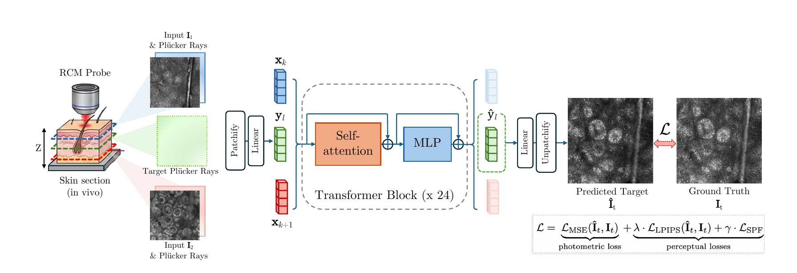

Imtiaz, Rajadhyaksha, Kose*, Dy* · Northeastern University &amp; Memorial Sloan Kettering Cancer Center (*equal contribution)

<a href="CD-RCM%20Explainer.html">View the interactive presentation →</a> · <a href="{{ '/presentations/' | relative_url }}">All presentations</a>

**Background.** Reflectance confocal microscopy (RCM) provides non-invasive, near-histologic "optical biopsies" of living skin. It is used for tumor diagnosis, inflammatory disease, and surgical-margin assessment.

Images are acquired as a stack of horizontal (en face) sections at successive depths. Lateral resolution is about 0.5 µm, but depth resolution, set by optical sectioning, is about 3 µm, roughly six times coarser. As a result, vertical sections comparable to histopathology show blocky staircase artifacts. Clinicians must mentally reconstruct depth structure, particularly around the dermal–epidermal junction (DEJ). Standard spline interpolation has no knowledge of skin anatomy.

Existing view-synthesis methods reconstruct opaque surfaces seen from different angles, and CT methods model X-ray attenuation. Most of these methods require slow optimization for every new case. RCM instead looks through tissue along a single axis, with shallower sections obscuring deeper ones.

**Methods.** CD-RCM treats the RCM probe as a virtual pinhole camera that moves only in depth. Each slice's camera position comes from its depth, normalized per stack, and every pixel is encoded with Plücker ray coordinates. The model then works in four steps:

1. Input slices and their rays are cut into 8×8-pixel patches and converted into tokens.
2. Each target depth is represented by ray tokens alone.
3. A 24-block transformer with bidirectional self-attention processes all tokens together. Its design is inspired by the LVSM view-synthesis model, and it has 170.8 million parameters.
4. Only the target tokens are decoded into the new slice.

The training loss combines three terms:

- pixel-wise error (MSE),
- the LPIPS perceptual metric,
- a new skin-specific perceptual loss. This loss is computed with a DINOv3 vision transformer adapted to RCM images through self-supervised LoRA training, so it rewards preserved cellular texture rather than pixel agreement alone.

During training, the model saw windows of nine consecutive slices. The first, middle, and last slices, about 6 µm apart, served as inputs, and four random slices in between were targets. At inference, any three evenly spaced slices can be used to generate slices at any depth between them, including depths between the originally acquired positions.

The dataset contained 216 in vivo stacks from a VivaScope 1500, taken from the arm and trunk of healthy volunteers aged 20 to 50. Each stack had 50 to 65 slices at 1.5 µm steps. Stacks were registered with SIFT-based alignment, resized to 512×512 pixels, and split by stack into 156 for training and 60 for testing. CD-RCM was compared with B-spline, cubic-spline, and Gaussian-smoothed interpolation using PSNR, SSIM, LPIPS, and the skin-specific metric.

**Results.** CD-RCM outperformed all baselines on all four metrics:

| Metric | CD-RCM | Best baseline |
|---|---|---|
| PSNR (higher is better) | 23.36 | 22.87 |
| SSIM (higher is better) | 0.581 | 0.522 |
| LPIPS (lower is better) | 0.314 | 0.375 |
| Skin-specific metric (lower is better) | 0.145 | 0.161 |

Gaussian interpolation gained PSNR by blurring, which erased diagnostically relevant detail. CD-RCM stayed both accurate and sharp, visibly preserving fine cellular structures and layer transitions.

In ablations, the skin-specific loss improved every metric compared with the standard VGG perceptual loss. SSIM rose from 0.567 to 0.597 and LPIPS fell from 0.329 to 0.288. Using single final-layer features worked better than a multi-layer variant.

Densifying a full stack tenfold took 0.8 seconds on one GPU, with no per-stack optimization. The densified volumes produced smooth sagittal, coronal, and arbitrary oblique sections without staircase artifacts. A diffusion-based alternative was also tested but failed to reconstruct fine structure.

**Conclusions.** CD-RCM is the first feedforward method for continuous-depth synthesis in RCM. It makes histology-like virtual vertical and oblique sectioning of living skin practical, and it could allow sparser, faster acquisition with fewer motion artifacts. It does not increase the microscope's optical resolution, and synthesized slices are model predictions that must be labeled as such.

Current limitations are healthy skin only, a single device, and a small dataset without subject-level split information. Some stacks also have residual misalignment, the model provides no uncertainty estimates, and it has not yet been evaluated on clinical tasks. Next steps include DEJ localization and skin-layer delineation, mosaics, lesions, and other optical-sectioning modalities such as line-field confocal OCT.

---

*Figure (paper, Fig. 2).* Sparse input slices with their Plücker rays, together with ray-only target tokens, pass through a 24-block transformer. Only the target tokens are decoded into the synthesized slice, and training combines pixel, LPIPS, and skin-specific perceptual losses.

