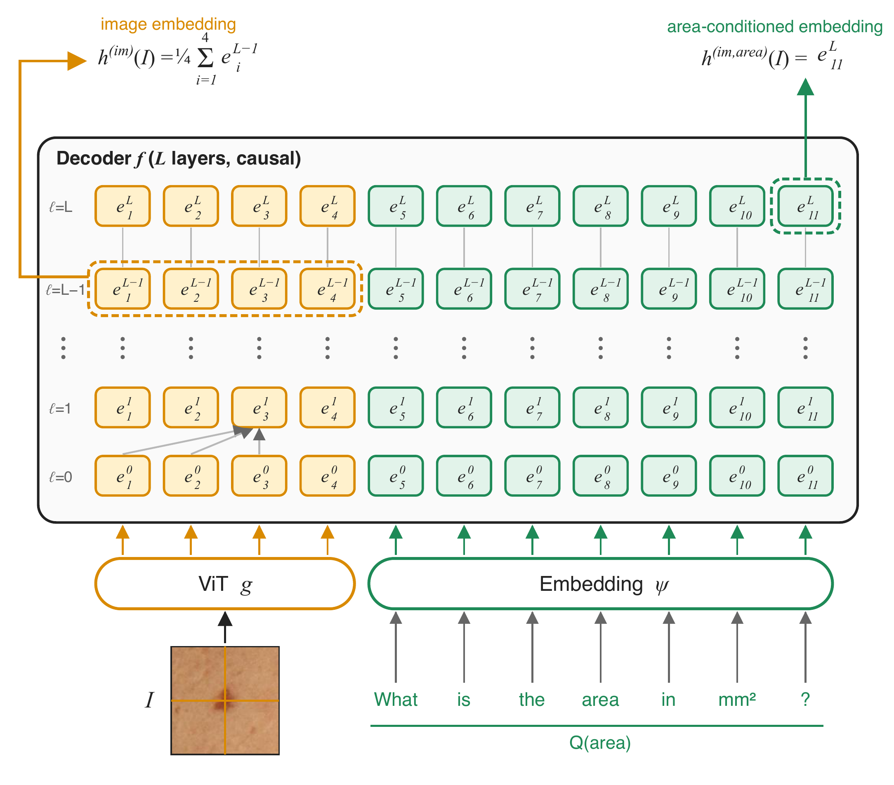

# Grounding Multimodal LLMs with Quantitative Skin Attributes: A Retrieval Study

Torop, Eskandar, Kurtansky, Liu, Weber, Camps, Rotemberg, Dy, Kose · Northeastern University & Memorial Sloan Kettering Cancer Center

## Clinical motivation

Skin-cancer classifiers reach dermatologist-level accuracy but remain black boxes. They can exploit spurious cues such as surgical markings, rulers, and hair. Saliency maps are an unreliable fix.

Quantitative lesion attributes from 3D total-body photography (TBP) are interpretable and predictive of malignancy. Examples include size, border irregularity, and lesion–skin contrast. Multimodal LLMs offer a natural-language interface for clinicians, but they are known to struggle with quantification.

**Goal:** ground an MLLM's representation in these attributes, and use it for attribute-steerable image retrieval.

## Data

- **Dataset:** SLICE-3D (ISIC 2024), consisting of 15 mm lesion tiles cropped from 3D TBP.
- **Train:** 401,059 images from 1,042 patients at 7 hospitals.
- **Test:** 511,474 private images from 1,277 patients at 9 sites. Two sites, FNQH Cairns and Monash, are out-of-distribution.
- **Attributes:** 16, chosen with domain experts:
  - Size: area, minor axis, perimeter, long diameter
  - Border: area/perimeter ratio, border irregularity
  - Color: color variation, radial color asymmetry
  - LAB values inside and outside the lesion: A, Aext, B, Bext, stdLExt
  - Contrast: ΔL, ΔB, ΔLB
- **Missing values:** a value of 0 means missing and is excluded.

## Method

**Model.** Qwen2-VL, with ViT encoder *g*, text-token embedding ψ, and causal decoder *f* (L layers).

**Training.** Each (image, attribute) pair becomes one visual-question-answering example, (I, Q(a), y_a(I)). The model maximizes the log-likelihood of the numeric answer given the image and the question.

| Setting | Value |
|---|---|
| Fine-tuning | LoRA (rank 8), encoder and decoder jointly |
| Epochs | 1 |
| Batch size | 16 |
| Learning rate | cosine schedule from 1e-4 |
| Hardware | 4× A6000 |

**Embeddings (see figure).**

- **Image-only**, $h^{(im)}(I)$: the mean of the image-token states at layer L−1. This is the last layer where image tokens feed directly into prediction, and it captures general appearance.
- **Attribute-conditioned**, $h^{(im,a)}(I)=f_{-1}([g(I),\psi(Q(a))])$: the last token's final-layer state after the image and question. This is a composed image+text query.
- **Multi-attribute**: a single prompt that asks for C attributes gives $h^{(im,a_1..a_C)}$, with no multi-attribute training.

**Retrieval.** The system returns the top-k images by cosine similarity, with the training set as the database. Storing embeddings for every attribute combination is combinatorial, so **hierarchical retrieval** is used:

1. Take the top *b* = 200 images by $h^{(im)}$.
2. Compute attribute-conditioned embeddings on the fly for those 200 only.
3. Return the top *k*.

## Results

**Attribute prediction.** Mean test **R² = 0.90**. The range runs from 0.79 (area/perimeter ratio) to 0.97 (ΔB, ΔL, ΔLB). Per-site means are 0.87–0.91, including **0.87 / 0.90** at the two unseen sites. The answer logits are computed from the same final-token embedding, so this directly shows that the embedding encodes the attributes.

**Retrieval.** For each top-5 result, the metric is the percentile rank of the squared query–result attribute difference among differences to all database images (lower is better). The table shows the median.

| Attribute | Im+Text | Hier. | Im. | Untuned | MONET | PanDerm |
|---|---|---|---|---|---|---|
| Area | **8.4** | 8.5 | 15.4 | 41.0 | 35.7 | 33.1 |
| Border irregularity | **16.9** | 17.0 | 21.2 | 36.0 | 33.9 | 32.7 |
| ΔLB | **6.3** | 6.5 | 11.2 | 28.8 | 22.2 | 21.5 |

The ordering is the same across all 16 attributes: Im+Text < Hier. < Im. < PanDerm/MONET < untuned. The hierarchical search is nearly lossless. On four attribute pairs, joint prompting dominates all baselines and trades off against single-attribute prompts.

**Diagnostic signal.** A logistic-regression probe was trained on the image-only embeddings:

- **Regularization:** L2, tuned by pAUC above TPR 0.80.
- **Validation:** 118,495 images (170 malignant).
- **Probe training:** 282,564 images (223 malignant).
- **Leakage control:** a separately fine-tuned model was used for hyperparameter selection.
- **Test:** 510,994 benign / 480 malignant.

| Metric | Ours | Untuned | MONET | PanDerm |
|---|---|---|---|---|
| AUROC (95% CI) | **0.928** (0.916–0.939) | 0.881 | 0.890 | 0.909 (0.894–0.922) |
| pAUC | **0.143** | 0.112 | 0.122 | 0.131 |

This is achieved with **no malignancy supervision**.

**Modality transfer.** On ISIC Archive dermoscopy, top-5 retrieval was compared against MONET, PanDerm, and ADAE. It *qualitatively* preserves scale-invariant features such as border irregularity and color asymmetry. Absolute mm predictions are ill-posed without magnification information.

## Clinical takeaways and limitations

Attribute supervision makes the embedding **interpretable and queryable**: *"lesions like this one, matched on diameter and contrast."* It does this without sacrificing diagnostic information.

Limitations:

- No clinician reader study.
- No skin-type stratification.
- Dermoscopy results are qualitative only.
- The AUROC confidence intervals overlap with PanDerm.
- Retrieval latency is not reported.

Future work: conversational reasoning, and validation across populations and devices.

---

*Figure (from the paper, Fig. 1).* The image-only embedding averages the penultimate-layer image tokens. The area-conditioned embedding is the final-layer state of the last token after the question "What is the area in mm²?"
